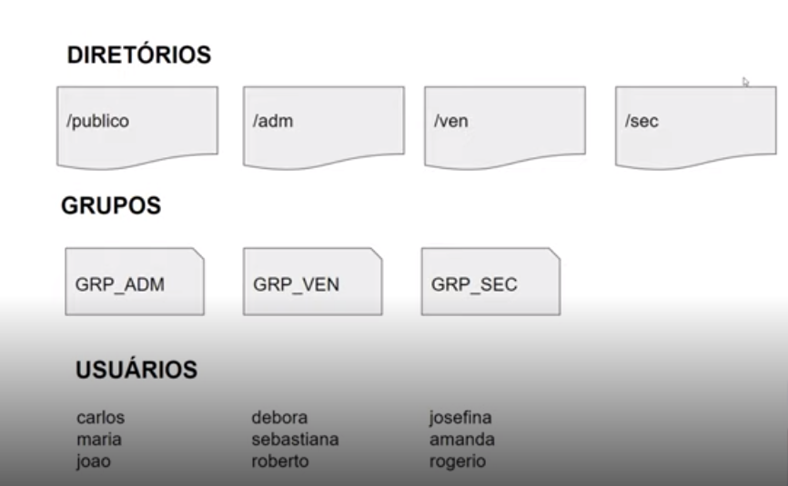

<h1> Desafio de projeto

**Infraestrutura como Código: Script de Criação de Estrutura de Usuários, Diretórios e Permissões**

##

Criando script para: 

- Criar usuários; 
- Criar grupos;
- Inserir os usuários em seus respectivos grupos;
- Dar permissões para os grupos.

 

Executando o script

./script.sh

Verificando se os usuários foram inseridos:

´cat /etc/passwd´

Verificando se os grupos foram criados:

´cat /etc/group´

Verificando as permissões:

´ls -l´

Verificar se nos grupos apresenta a seguinte informação

´drwxrwx---´

